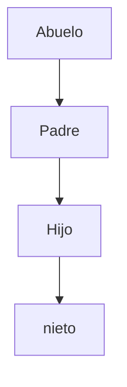
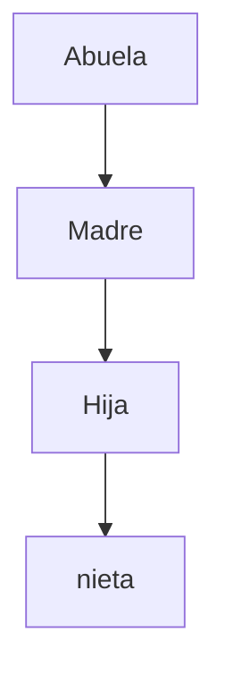

# Desarrollo de actividad 1

###### Crear un arbol genialogico de la familia, creando carpeta con su respectivo archivo .txt con la informacion del miembro de la familia:
###### Nombre: XXXXXXX
###### Apellidos: XXXXXXX
###### Estatura: XXXXXXX

## Orden de arbol paterno


## Orden de arbol materno



***COMANDOS A REALIZAR:***
## ``` pwd ``` para obtener la ubicacion actual en la terminal
## ``` cd XXXXXXX ``` para navegar o dirigirse a la carpeta deseada
## ``` mkdir XXXXXXX ``` para crear una carpeta o directorio
## ``` vi XXXXXXX.txt ``` para crear un documento 
### Para editar un documento se debe presionar la tecla **Insert** y asi se habilitará el modo edición y una vez se termine de editar y se quiera salir, sedebe presionar la tecla **Esc**
## ``` :wq! ``` para guardar y salir del documento editado


1. Se abre la terminal de linux y para saber en que directorio esta ubicado, se ejecuta el comando  ``` pwd ```
2. se dirige a la ruta donde desea almacenar los archivos que se crearán, para el siguiente caso, se cuenta con una carpeta llamada 'Taller1' la cual esta dentro de la carpeta documentos; asi  que se ejecuta el comando ``` cd /Documentos ``` y posterior a ello, ``` cd taller1/ ```
3. Para iniciar, con el comando ``` mkdir abuelo ``` creo la carpeta abuelo
4. Para ingresar a la carpeta abuelo, se ejecuta el comando ``` cd abuelo/ ```, una vez este en dicha carpeta se procede a crear la carpeta padre con el comando ``` mkdir padre ```.
5. 
6. En el taller, se pide crear un archivo con la información de cada miembro del arbol genealogico que se esta creando; por ende, se ejecuta el comando ``` vi hector_orlay.txt ``` el cual abrirá un archivo nuevo. PAra editar el archivo se presiona la tecla ***Insert*** y esta habilitará el modo escritura.
7. Ingresa los datos del formato indicado al inicio del redme (Nombre, Apellido, Estatura) y para guardar se presiona la tecla **Esc** luego ``` :wq!``` para guardar el archivo hector_orlay.txt editado. 
8. ***NOTA*** ':w' indica guardar del archivo, concatenado 'q' se le esta indicando que desea salir del archivo y el signo ``` ! ```, esta indicando que desea hacerlo de forma forzada (en el ejercicio se indico ! para que el comando :wq no solicitará confirmacion de la accion)
9.  La siguiente imagen es un ejemplo de los pasos 6 y 7


10. ``` cd padre/ ``` para dirigirse a la carpeta recien creada y repetimos el paso 6 y 7 para crear el archivo respectivo de la carpeta 'padre'
11. Se crea la carpeta hijo, estando ubicados en la carpeta 'padre' con el comando ´´´ mkdir hijo´´´ y posterior a ello, el comando ´´´ vi roberto.txt ´´´ permitira crear el archivo .txt para los datos del hijo. Se debe  presionar la tecla ***Insert*** y esta habilitará el modo escritura, luego de ingresar los datos, sepresiona la tecla **Esc** para salir y siempre que se termine de editar un archivo se procede a ejecutar el comando ``` :wq!``` para guardar los cambios y salir del archivo
12. se repiten los pasos del 3 al 8 para terminar la jerarquia deseada.
13. Se valida si el plugin tree esta instalado en el sistema operativo ejecutando el comando ``` tree ``` con el objetivo de que se pueda visualizar un poco mas ordenado el proceso que se realizo 
14. Para el ejercicio, se esta ejecutando el distro de fedora y ya porta este plugin por defecto asi que no se realizo instalacion adicional.
15. Se dirige a la carpeta inicial de la jerarquia que en este caso es la carpeta 'abuelo' con el comando  ``` cd /abuelo ```
16. Se ejecuta el comando ``` tree ```  para obtener l visualizacion del arbol completo que se puede observar en la siguiente imagen.
17. 

## Se repite el proceso para realizar la jerarquia del arbol genealogico de la abuela

18. Al finalizar la actividad, se tienen dos carpetas 'abuela' y 'abuelo' con sus archivos .txt y las demas carpetas internas como se ilustra en la siguiente imagen
19. 


