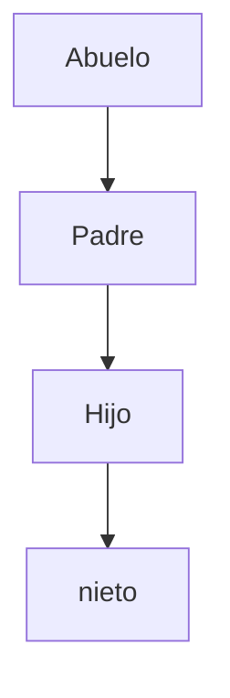
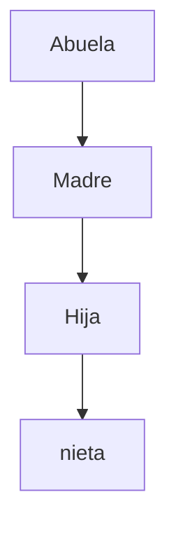

# Desarrollo de actividad 1

###### Crear un arbol genialogico de la familia, creando carpeta con su respectivo archivo .txt con la informacion del miembro de la familia:
###### Nombre: XXXXXXX
###### Apellidos: XXXXXXX
###### Estatura: XXXXXXX



1. Se abre la terminal de linux y para saber en que directorio esta ubicado, se ejecuta el comando  ``` pwd ```
2. se dirige a la ruta donde desea almacenar los archivos que se crearán, para el siguiente caso, se cuenta con una carpeta llamada 'Taller1' la cual esta dentro de la carpeta documentos; asi  que se ejecuta el comando ``` cd /Documentos ``` y posterior a ello, ``` cd taller1/ ```
3. Para iniciar, con el comando ``` mkdir abuelo ``` creo la carpeta abuelo
4. Para ingresar a la carpeta abuelo, se ejecuta el comando ``` cd abuelo/ ```, una vez este en dicha carpeta se procede a crear la carpeta padre con el comando ``` mkdir padre ```.
5. 
6. En el taller, se pide crear un archivo con la información de cada miembro del arbol genealogico que se esta creando; por ende, se ejecuta el comando ``` vi hector_orlay.txt ``` el cual abrirá un archivo nuevo. PAra editar el archivo se presiona la tecla *** Insert *** y esta habilitará el modo escritura.

7. ``` cd padre/ ``` para dirigirse a la carpeta recien creada y 


