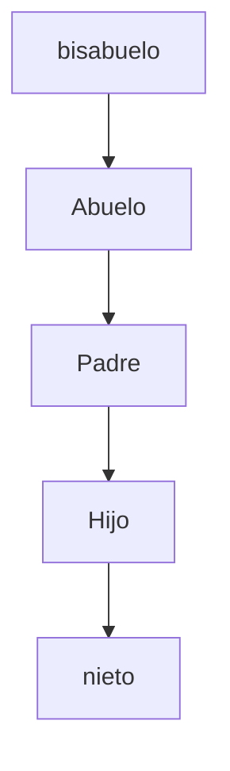
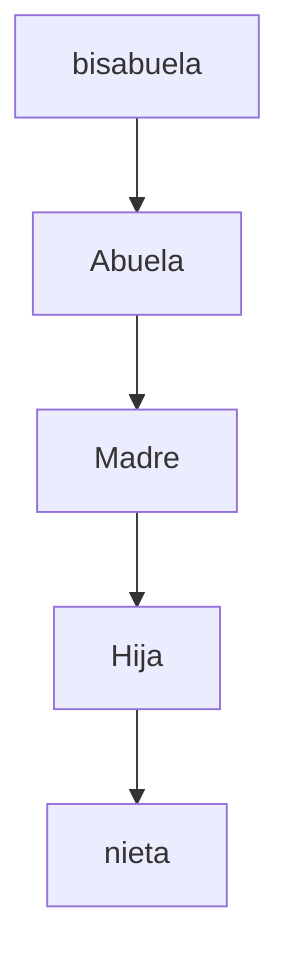

# Desarrollo de actividad 2
###### 1. Recuperar o modificar contraseña de usuario root

1. Se reinicia la maquina con el fin de interrumpir el arranque. Segun las indicaciones de la distro, para fedora se interrumpe presionando ***fn + f12*** 


2. Posterior a ello, se presiona ***ctrl + e*** para modificar las opciones de boot; en la linea 5 de la siguiente imagen, se puede visualizar como se añade la directiva ´´´ rd.break ´´´ en las opciones de arranque del sistema, en la linea donde se visualiza ´´´ rhgb quiet ´´´  asi parar el proceso de arranque del sistema antes de comenzar a montar filesystems; ´´´ ctrl + x ´´´ para ejecutar las opciones indicadas.


 
 
4. Se presiona continuar
5. En la consola se ejecuta el comando ´´´ chroot /sysroot´´´  para 


## 2. Modificar el arbol genealogico creado en el taller #1 para agregar las carpetas bisabuela y bisabuelo con sus respectivos archivos .txt

###### Se deben mover todos los archivos .txt de la jerarquia materna a la paterna, de igual forma se deben mover los archivos .txt de la jerarquia paterna a la materna.
***Ejemplo:***


El archivo hector_orlay.txt moverlo del directorio abuelo al directorio abuela y el archivo luz.txt moverlo del directorio abuela al directorio abuelo
## Orden de arbol paterno


## Orden de arbol materno



***COMANDOS A REALIZAR:***
## ``` pwd ``` para obtener la ubicacion actual en la terminal
## ``` cd XXXXXXX ``` para navegar o dirigirse a la carpeta deseada
## ``` mkdir XXXXXXX ``` para crear una carpeta o directorio
## ``` vi XXXXXXX.txt ``` para crear un documento
## ``` mv /ubicacionActual /ubicacionDeseada ``` para mover un directorio o archivo de una ubicación actual a una ubicación deseada
### Para editar un documento se debe presionar la tecla **Insert** y asi se habilitará el modo edición y una vez se termine de editar y se quiera salir, sedebe presionar la tecla **Esc**
## ``` :wq! ``` para guardar y salir del documento editado
## ``` rm -Rf  XXXXXXX.txt ``` para eliminar un archivo
***Importante:***
###### Para eliminar un archivo se ejecuta el comando rm (remover), se agrega -R cuando es un directorio, para indicar que es recursivo o que se debe eliminar todo el directorio -f para indicar que es forzado, de esta manera no se requiere confirmación para la accion de remover; de esta manera si quisieramos eliminar el directorio **/bisabuela** , se debe ejecutar el comando  ``` rm -Rf /bisabuela ```, pero si lo que se desea eliminar es el **archivo .txt** de ese directorio, seria  ``` rm -f /bisabuela/juana.txt ```


1. Se abre la terminal de linux y para saber en que directorio esta ubicado, se ejecuta el comando  ``` pwd ```
2. Se dirige al directorio /Documentos/taller1 que es donde se trabajo el taller pasado.
3. Como se debe crear dos directorios mas, se procede a ejecutarlos con los comandos ``` mkdir bisabuela ``` y ``` mkdir bisabuelo ``` como se observa en la imagen siguiente 


4. Para eliminar un archivo, se ejecuta el comando ``` rm -Rf  directorio ```. Por ejemplo, se desea eliminar el archivo juana.txt/ que esta dentro del directorio bisabuela, pero se creo por error como un directorio y no como un archivo; entonces se ejecuta ``` rm -Rf  juana.txt/ ``` como lo muestra la siguiente imagen


6. Se debe dirigir a la carpeta bisabuela y crear el correctamente el archivo juana.txt con los datos requeridos en el taller1 y de la misma forma, se redirige al directorio /bisabuelo y se crea el archivo correspondiente
7. para formar el arbol genealogico con los datos del taller pasado, se debe mover el directorio /abuela con todo su contenido al directorio /bisabuela recien creado
8. Ahora se mueve todo el contenido del directorio /abuelo al directorio /bisabuelo como se muestra en la imagen con su nueva jerarquia.


9. Ahora, se desea intercambiar los archivos de cada directorio con su simil jerarquico en el otro conjunto de directorios. **Ejemplo:**

pasar el archivo /bisabuela/juana.txt al directorio /bisabuelo  && pasar el archivo /bisabuelo/ruben.txt al directorio /bisabuela


10. Se debe tener muy presente para mover archivos, en que directorio se encuentra. Para el ejercicio, se ejecutan secuencialmente los archivos como lo muestra en la figura, jecutando ``` mv /bisabuela/juana.txt /bisabuelo ``` , ``` mv /bisabuelo/ruben.txt /bisabuela ``` , ``` mv /bisabuela/abuela/luz.txt /bisabuelo/abuelo ``` ,``` mv /bisabuelo/abuelo/hector_orlay.txt /bisabuela/abuela ```. 


11. Al fincalizar el proceso, se evidencia que se movieron solo los archivos .txt de la jerarquia materna a la paterna y biceversa, como lo muestra la imagen ordenada con el comando  ``` tree ``` desde el directorio /taller1 que es el que contiene ambos arboles genealogicos


