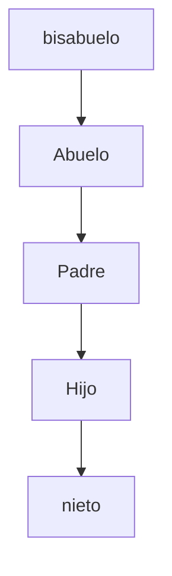
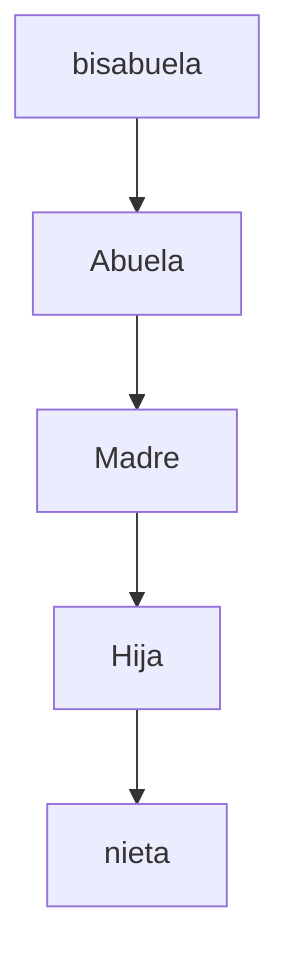

# Desarrollo de actividad 2

###### Modificar el arbol genealogico creado en el taller #1 para agregar las carpetas bisabuela y bisabuelo con sus respectivos archivos .txt

###### Se deben mover todos los archivos .txt de la jerarquia materna a la paterna, de igual forma se deben mover los archivos .txt de la fajerarquia paterna a la materna.
***Ejemplo:***

El archivo hector_orlay.txt moverlo del directorio abuelo al directorio abuela y el archivo luz.txt moverlo del directorio abuela al directorio abuelo
## Orden de arbol paterno


## Orden de arbol materno



***COMANDOS A REALIZAR:***
## ``` pwd ``` para obtener la ubicacion actual en la terminal
## ``` cd XXXXXXX ``` para navegar o dirigirse a la carpeta deseada
## ``` mkdir XXXXXXX ``` para crear una carpeta o directorio
## ``` vi XXXXXXX.txt ``` para crear un documento
## ``` mv /ubicacionActual /ubicacionDeseada ``` para mover un directorio o archivo de una ubicación actual a una ubicación deseada
### Para editar un documento se debe presionar la tecla **Insert** y asi se habilitará el modo edición y una vez se termine de editar y se quiera salir, sedebe presionar la tecla **Esc**
## ``` :wq! ``` para guardar y salir del documento editado


1. Se abre la terminal de linux y para saber en que directorio esta ubicado, se ejecuta el comando  ``` pwd ```
